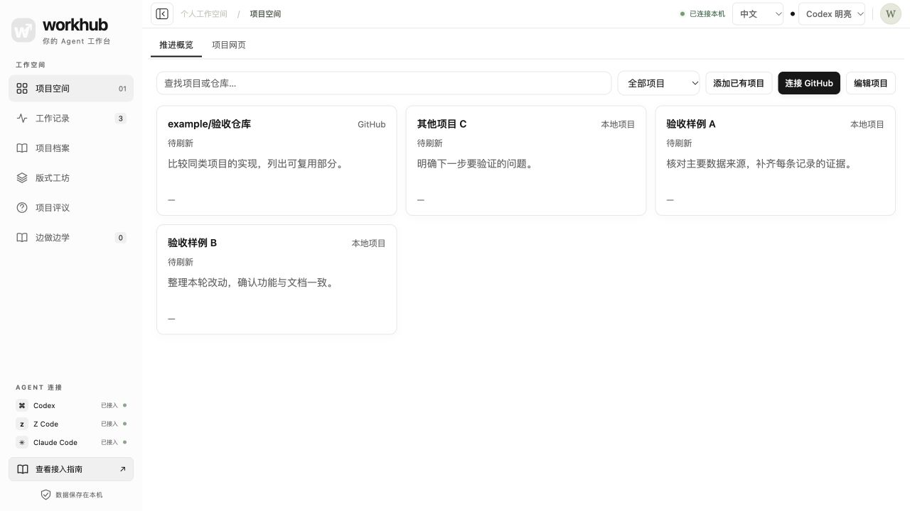
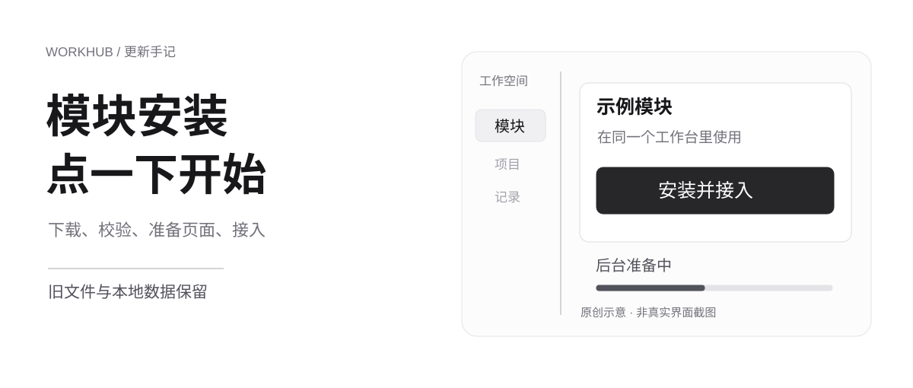
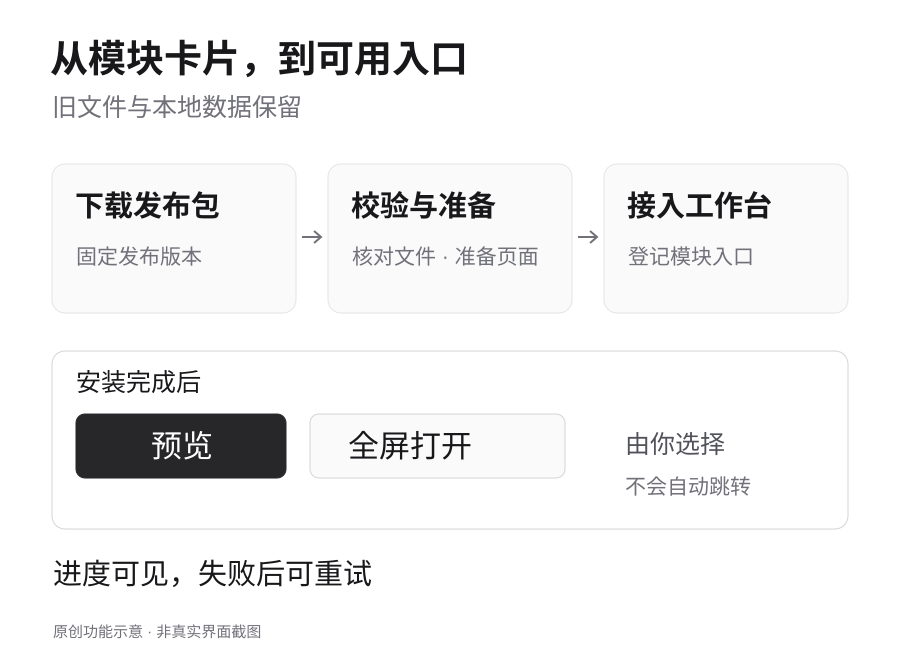

[简体中文](README.md) · [English](README.en.md)

# Workhub

在同一个本地工作台切换项目网站、查看 Git 与 Agent 的工作记录，并为每个项目留下一步行动。



在仓库根目录运行服务，需要 Python 3.10 或更高版本。

```sh
python3 workhub.py serve --port 8787
```

打开终端显示的地址，选“添加已有项目”，再选本机目录。如想先看虚构项目，运行 `python3 examples/demo.py --port 8899`。

卡片点开后展示完整详情，返回保留筛选。进入“编辑项目”可选择当前可见项目，批量从中控移除；本地文件、网站、工作记录和远端仓库保留。

默认先显示“项目网页”：条目主体用于预览，独立“全屏”按钮用于铺满窗口。左侧“模块”集中展示六个可选模块，点击“安装并接入”即可自动下载、校验并准备本机入口。

工作记录存入本机 SQLite。浏览项目无需模型密钥。启动项目评议时，选定的摘要和补充背景会交给你配置的 API、模型或 CLI。

[安装与 Agent 接入](docs/installation.md) · [GitHub 快照与项目推进](docs/project-control.md) · [模型设置](docs/providers.md) · [数据与隐私](docs/privacy.md) · [可选模块](https://github.com/8eeth0ven/workhub-model)

<details>
<summary>模块自动安装 · 看图了解</summary>





</details>
